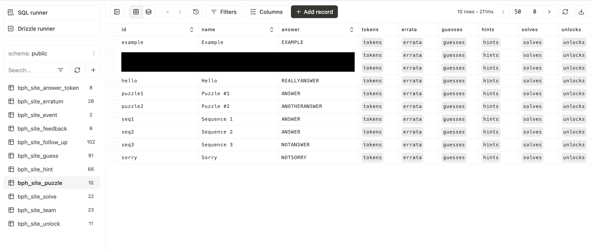

## Table of Contents

- [Postprodder guide](#postprodder-guide)
    - [First steps](#first-steps)
    - [Adding puzzles](#adding-puzzles)
    - [Creating puzzle and solution bodies](#creating-puzzle-and-solution-bodies)
- [Developer guide](#developer-guide)
    - [Overview](#overview)
    - [Quick Links](#quick-links)
    - [Features](#features)
    - [Copying this repository](#copying-this-repository)
    - [Setting up the database](#setting-up-the-database)
    - [Setting up the dev environment](#setting-up-the-dev-environment)
    - [Hunt Structure](#hunt-structure)
    - [Final Checks](#final-checks)
- [Admin guide](#admin-guide)
    - [Navigation](#navigation)
    - [Hinting and Errata](#hinting-and-errata)
    - [Team Management](#team-management)

## Postprodder guide

This is for the postprodding team. It assumes that there is already a hunt set up.

#### First steps
1. Clone this repository
2. Get the `.env` and put it in the root directory
1. Install [pnpm](https://pnpm.io/)
3. Run `pnpm install` to install the dependencies
6. Create a new branch called `your-name-postprodding`

Now you're all ready to start postprodding! 

To run the development server and see your changes live:
1. Run `pnpm run dev`
2. Login with `admin123` as the username and password
3. Go to `http://localhost:3000/admin/solutions`

#### Adding puzzles

1. Add the puzzle to the database
    
    First, run `pnpm run db:studio` and go to `https://local.drizzle.studio/`. You will see a lot of different tables, but the only one you need to edit is `bph_site_puzzle`. 

    

    The `name` column is the title of the puzzle, the `id` column is the slug (URL) for the puzzle, and the `answer` column is the answer to the puzzle in **all caps, no spaces.**

    ```ts
    {
        id: "example",
        name: "Example",
        answer: "ANSWER"
    }
    ```

3. Next, we will create a web page for the puzzle. 

   Copy the contents of the `src/app/(hunt)/puzzle/(dev)/example` folder to a new folder inside of `src/app/(hunt)/puzzle/`. The new folder name should be the puzzle id. 

   Notice that the dev puzzles are in `src/app/(hunt)/puzzle/(dev)`, but the real hunt puzzles are in  `src/app/(hunt)/puzzle`. (Yes, we would be making another example puzzle here.)

    ```
    .
    ├── (dev)/
    │   └── example
    │       ├── data.tsx
    │       ├── hint
    │       ├── layout.tsx
    │       ├── page.tsx
    │       └── solution
    ├── actions.tsx
    ├── components/
    ├── page.tsx
    ├── sequences.ts
    └── example/
        ├── data.tsx
        ├── hint
        ├── layout.tsx
        ├── page.tsx
        └── solution
    ```

4. **Hard-code the puzzle id, the puzzle body, and the solution body inside of data.tsx.** 

    You can also add copy text, partial solutions, and extra tasks. Set values to null or empty if they don't exist. 
    More information about creating puzzle bodies [below](#creating-puzzle-and-solution-bodies). 

    ```ts
    export const puzzleId = "example";

    export const puzzleBody = (
        <div>
            <p>Here is an example puzzle.</p>
        </div>
    );

    export const solutionBody = (
        <div>
            <p>Here is the solution to the example puzzle.</p>
        </div>
    );

    export const copyText = `1\t2\t3
    4\t5\t6
    7\t8\t9`;

    export const partialSolutions: Record<string, string> = {
        ALMOSTANSWER: "Almost there!"
    };
    ```

5. **For sequences**, update the `SEQUENCES` in `hunt.config.ts`. Puzzles can be in multiple sequences. Each sequence includes an optional name, an icon, and an ordered list of puzzles. See https://lucide.dev/icons/ for icons.

    ```ts
    export const SEQUENCES = [
        { name: "examples", icon: Grid3X3, puzzles: ["example", "example-2", "example-3"] },
        { name: "variety", icon: Swords, puzzles: ["example", "display", "test"] }
    ];
    ```

#### Creating puzzle and solution bodies

1. If the original puzzle is on a **Google Doc**, try exporting it as a Markdown file. Then put that in a Markdown-to-HTML converter like this [one](https://markdowntohtml.com/).

4. If you want some vertical spacing between elements, use `mb-4`.

   ```html
    <div>
        <p className="mb-4">Solve this puzzle.</p>
        <Image src="/puzzle/sudoku-51.png" width={500} height={500} alt="" className="mb-4"/>
    </div>
   ```

5. If you need a space between a `p` and a `span`, use `{" "}`.
  
      ```html
      <p>This puzzle is{" "}<span className="underline">difficult</span>.
      ```


3. If there is an **image**, use the Next.js `Image` component instead of the `img` tag. Put it somewhere in the puzzle folder and call it like this:

    ```html
    import SUDOKU_51_ANSWER from "./solution/sudoku-51-answer.png";
    <Image src={SUDOKU_51_ANSWER} width={500} height={500} alt="" />
    ```

    Next.js documentation will tell you to put images in the `public` folder. It is important that you **don't** put puzzle images there, because anyone can access it.

4. If there is a **list**, use a [Tailwind utility](https://tailwindcss.com/docs/list-style-type). Otherwise, it won't show up. Here, we're using the `list-decimal` utility.

    ```html
    <ul className="list-decimal">
        <li>One</li>
        <li>Two</li>
        <li>Three</li>
    </ul>
    ```


5. If you want to **hide** some text, change the background using a `span`.

    ```html
    <p>The answer is{" "}<span className="bg-main-text">ANSWER</span>.
    ```

## Developer guide

This assumes that you are setting up a new hunt from scratch.

#### Overview
This project is built using **Next.js v14** using the App Router (not the Pages Router). The frontend is in the `src/app` folder, and the backend is in the `src/server` folder.

We use Vercel **Postgres** as the database and **Drizzle** as the ORM. All of the code for the database is in the `src/server/db` folder.

Most of the client-to-server communication is currently handled by Vercel Server Actions. 
Server Actions allow us to execute database queries or API calls inside of a React component without needing to explicitly define an API route.
Note that Server Actions can only be defined in Server Components marked with the `use server` directive.
To make them available in Client Components marked with the `use client` directive, they must be imported or passed as a prop.
Server Actions are generally located in `actions.tsx` files distributed throughout `src/app`.

Authentication, authorization, and session management is handled by **Auth.js**.
We only support username/password authentication using the `Credentials` provider.
Sessions are stored in Json Web Tokens (JWTs) instead of database sessions.
The setup is in the `src/server/auth` folder.

Finally, on the frontend, we are using **Shadcn UI** components with the **Tailwind CSS** framework. Components are in the `src/components/ui` folder.

#### Quick Links
Make sure to check that you are reading documentation for Next.js with the App Router, not the Pages Router.

Auth.js is formerly known as NextAuth.js. 
Most documentation out there is still for v4, so check that you are reading documentation for v5.

- [Next.js](https://nextjs.org/docs/app) with the App Router
- [Vercel Postgres](https://vercel.com/docs/storage/vercel-postgres)
- [Drizzle](https://orm.drizzle.team/docs/overview)
- [Auth.js](https://authjs.dev/) v5
- [Vercel Server Actions](https://nextjs.org/docs/app/building-your-application/data-fetching/server-actions-and-mutations)
- [Tailwind CSS](https://tailwindcss.com/docs/installation)
- [Shadcn](https://ui.shadcn.com/docs)


#### Features
1. In terms of hunt logistics:
    1. Registration opens
    2. Registration closes
    3. When the hunt starts, puzzles drop
    4. When the hunt ends, guesses are frozen

2. Teams can:
    1. Register (`src/app/register`)
    2. Login (`src/app/login`)
    3. Make guesses (`src/app/puzzle/components/GuessForm.tsx`)
    4. See previous guesses (`src/app/puzzle/components/PreviousGuessTable.tsx`)
    5. Request hints (`src/app/puzzle/components/HintForm.tsx`)
    6. See previous hints (`src/app/puzzle/components/PreviousHintTable.tsx`)
    7. See the leaderboard (`src/app/leaderboard`)

3. Admins can:
    1. See all teams (`src/app/admin/teams`)
    2. See all guesses (`src/app/admin/guesses`)
    3. See all requests for hints (`src/app/admin/hints`)
    4. Give teams hints (`src/app/admin/hints`)

#### Copying this repository
I recommend duplicating this repository for each hunt. If you probably want to get updates from the original repository, you can follow these steps:

1. Create a bare clone of this repository.
    ```
    git clone --bare https://github.com/brown-puzzle-hq/bph-site.git
    ```
2. Create a new repository on GitHub. You will get an URL for this repository.

3. Mirror-push to the new repository.
    ```
    cd bph-site.git
    git push --mirror https://github.com/YOUR_USERNAME/NEW_REPOSITORY.git
    ```
4. Remove the temporary repository.
    ```
    cd ..
    rm -rf bph-site.git
    ```
5. Clone the new repository to your local machine.
    ```
    git clone https://github.com/YOUR_USERNAME/NEW_REPOSITORY.git
    ```

6. Add the original repository as a remote branch `public`.
    ```
    git remote add public https://github.com/brown-puzzle-hq/bph-site.git
    ```

7. To get changes from the original repository, run
    ```
    git fetch public
    ```

8. To merge changes from the original repository, run
    ```
    git merge public/main
    ```

There is more information on the [GitHub docs](https://docs.github.com/en/repositories/creating-and-managing-repositories/duplicating-a-repository).

#### Setting up the database

1. Take a look at `.env.example`. You will need to fill in the `DATABASE_URL` and `DRIZZLE_URL` fields. If you don't have a preexisting database, the easiest thing to do is to sign up for a Neon Postgres database.

2. Push the schema to the database. This only needs to be done when you update the schema in `src/server/db/schema.ts`.
    ```
    pnpm run db:push
    ```

3. Run Drizzle studio to look at the database.
    ```
    pnpm run db:studio
    ```

#### Setting up the dev environment

1. Download all of the dependencies. This only needs to be done when you update the dependencies in `package.json`.
    ```
    pnpm install
    ```

2. Start the development server.
    ```
    pnpm run dev
    ```

#### Hunt Structure

Most of the customizable features of the hunt structure is in `hunt.config.ts`.
Edit `/puzzle/actions.ts` to change how it handles guesses and solves.

#### Final Checks

Make sure that `hint.config.ts` is correct. 

Before registration starts,
1. Set `REGISTRATION_START_TIME` and `REGISTRATION_END_TIME`
2. Set `HUNT_START_TIME` and `HUNT_END_TIME`

Before the hunt starts,
1. Set `NUMBER_OF_GUESSES_PER_PUZZLE`
6. Set `INITIAL_PUZZLES` and `PUZZLE_UNLOCK_MAP`
7. Set `getTotalHints`
4. Remove the development puzzles in `src/app/(hunt)/puzzle/(dev)/`.

## Admin guide

This assumes that you are an admin for the hunt and will not need to make any changes to the code.

#### Navigation
For admins, there is an `admin` section and a `hunt` section with different navbars. You can navigate using the navbar or the command palette (`Cmd-K` or `Ctrl-K`). This works reliably on Chrome, but you might need to refresh on Safari or other browsers. 

#### Hinting and Errata
This can be managed in the `admin` section under `admin/hints` and `admin/errata`.

#### Team Management
Team password resets can be made in `teams/[id]`. Please don't change them directly in the Drizzle database. It won't work correctly because passwords need to be hashed.
